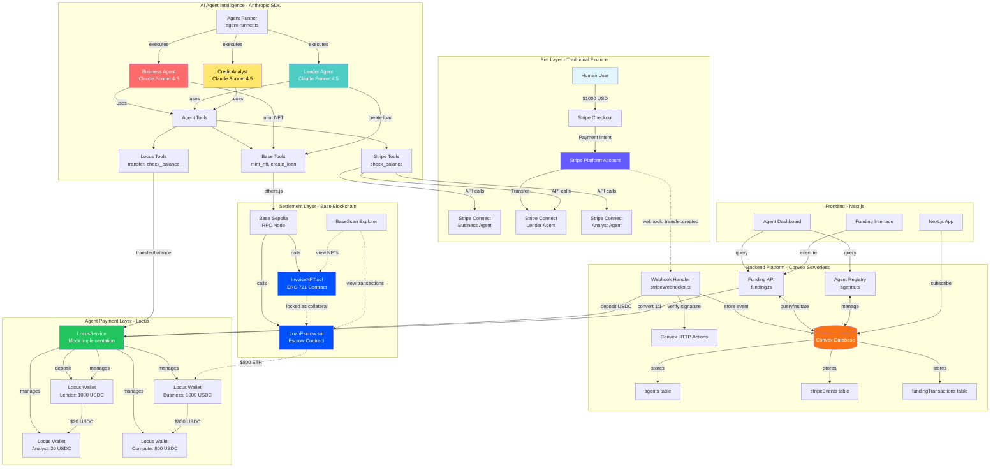
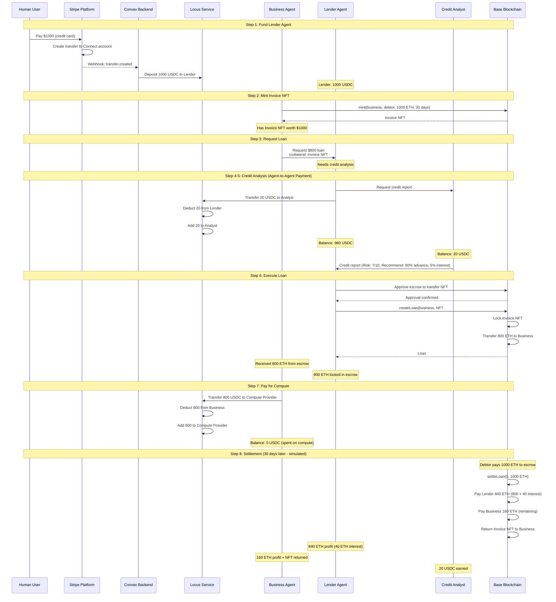
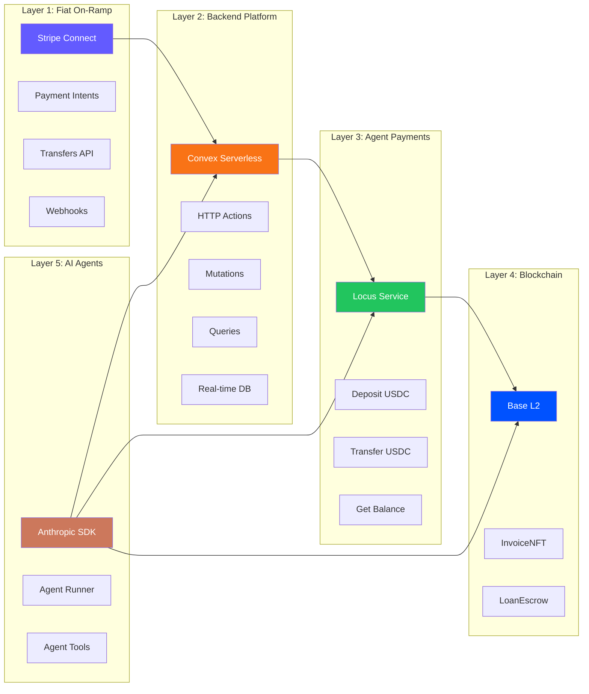
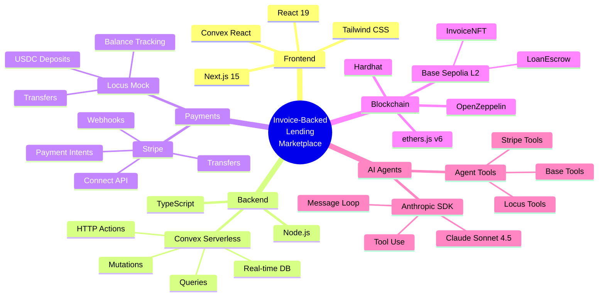

# System Architecture

## Complete System Architecture

---

## Data Flow: End-to-End Lending Flow

---

## Component Architecture

---

## Technology Stack Map

---

## See Also

- [LOCUS_ARCHITECTURE.md](./LOCUS_ARCHITECTURE.md) - Detailed Locus integration diagram
- [README.md](../README.md) - Main project documentation
- [FAQ.md](../FAQ.md) - Frequently asked questions
