# Locus Integration Architecture

## Locus's Role in the System

Locus serves as the **Agent Payment Layer**, enabling fast, low-cost USDC transfers between AI agents.

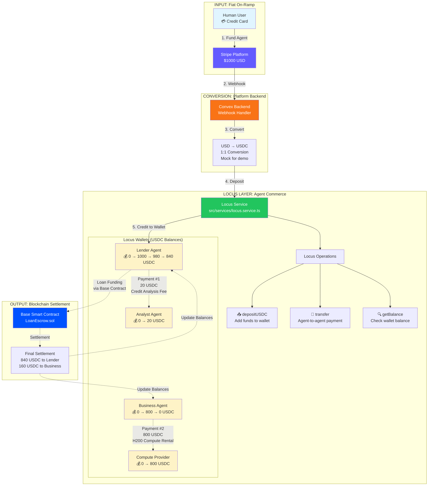

---

## Locus Transaction Flow

### Transaction 1: Deposit (Stripe → Locus)

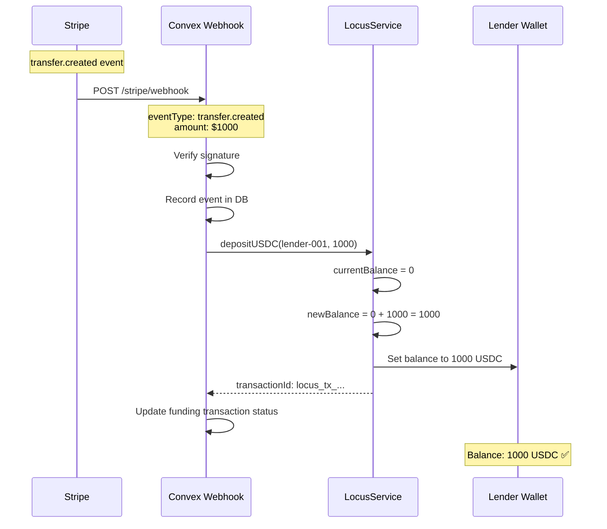

---

### Transaction 2: Agent-to-Agent Transfer (Lender → Analyst)

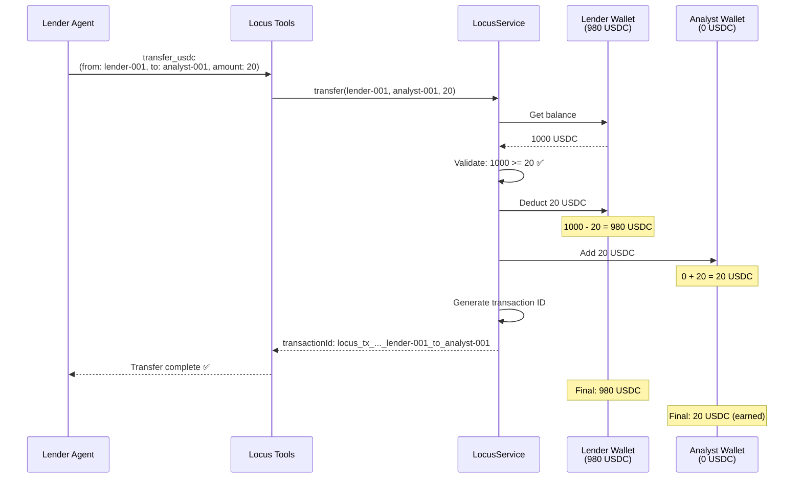

---

## Locus Service Architecture

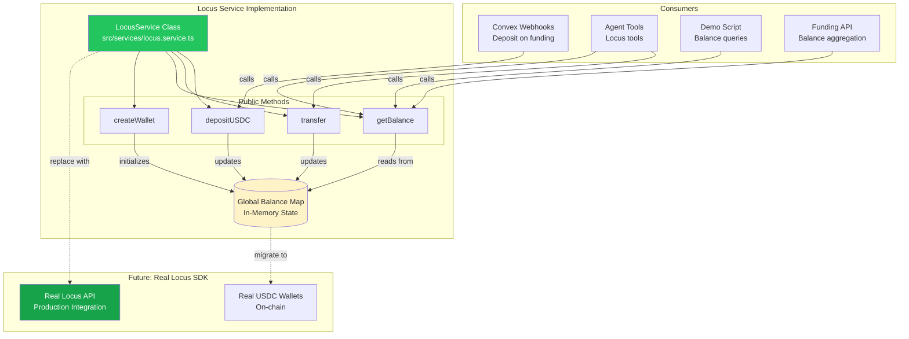

---

## Locus Payment Scenarios

### Scenario 1: Service Payment (Micro-transaction)

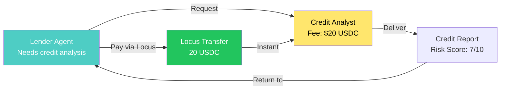

**Why Locus is Perfect for This:**
- **Fast**: Instant transfer, no waiting for settlement
- **Cheap**: Micro-payment friendly (no $0.30 base fee like Stripe)
- **Programmatic**: No human approval needed
- **Agent-to-Agent**: Direct payment between autonomous systems

**Alternative with Stripe:**
- ❌ Can't transfer between Connect accounts
- ❌ $0.30 fee + 2.9% = $0.88 total (440% overhead on $20!)
- ❌ Requires human approval for transfers

---

### Scenario 2: High-Value Payment (Compute Purchase)

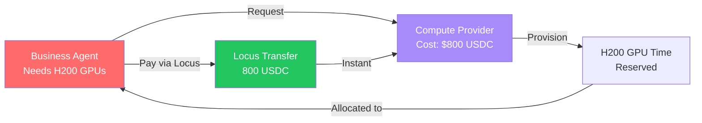

**Why Locus is Perfect for This:**
- **Instant**: Agent can start compute immediately
- **Autonomous**: No human approval for $800 transfer
- **Atomic**: Payment and service provision can be atomic
- **Programmable**: Easy to integrate with compute APIs

**Alternative with Stripe:**
- ❌ Can't do account-to-account transfers
- ❌ Would need human approval for $800 payment
- ⚠️ ACH settlement takes 2-3 days
- ❌ High fees: $23.50 + $0.30 = $23.80 (3% overhead)

---

## State Management: Current vs. Proposed

### Current Implementation (Hackathon)

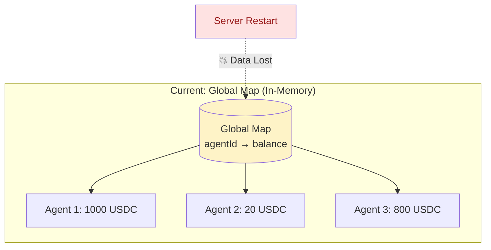

**Pros:**
- ✅ Fast (in-memory)
- ✅ Simple implementation
- ✅ Fixed state isolation bug

**Cons:**
- ❌ Lost on restart
- ❌ No transaction history
- ❌ No real-time subscriptions
- ❌ Not production-ready

---

### Proposed: Convex Database (Production)

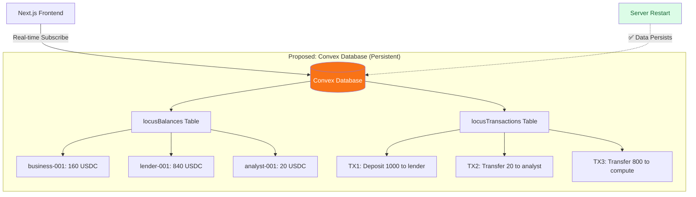

**Pros:**
- ✅ Persists across restarts
- ✅ Transaction history and audit trail
- ✅ Real-time subscriptions for frontend
- ✅ Production-ready
- ✅ Type-safe with schema

**Cons:**
- ⚠️ Slightly more complex
- ⚠️ Requires migration work

**Migration Ticket**: [Issue #2](https://github.com/micahstubbs/ycagentpayhack/issues/2)

---

## Locus Integration Points

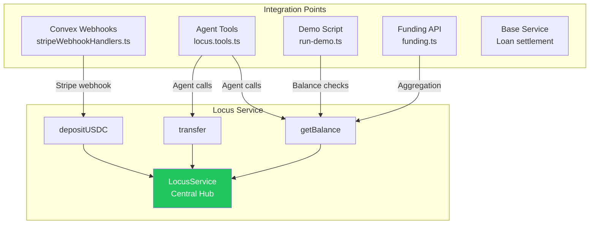

### When Locus is Called

**1. Stripe Webhook (Funding)**
- **Trigger**: User funds agent via Stripe
- **File**: `convex/stripeWebhookHandlers.ts:71-80`
- **Operation**: `depositUSDC(agentId, usdcAmount)`
- **Result**: Agent's Locus wallet credited with USDC

**2. Agent Tool Execution (Transfers)**
- **Trigger**: Agent decides to pay another agent
- **File**: `src/agents/tools/locus.tools.ts:32-50`
- **Operation**: `transfer(fromAgent, toAgent, amount)`
- **Result**: USDC moves between agent wallets

**3. Balance Queries**
- **Trigger**: Agent checks balance, demo displays balances, API queries
- **Files**: Multiple (agent tools, demo script, funding API)
- **Operation**: `getBalance(agentId)`
- **Result**: Current USDC balance returned

---

## Locus vs. Other Components: Clear Separation

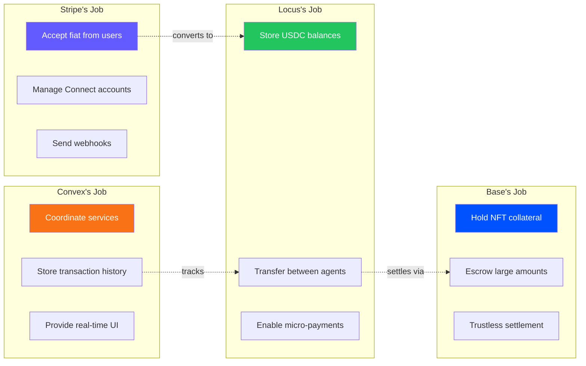

---

## Why Three Payment Layers Instead of One?

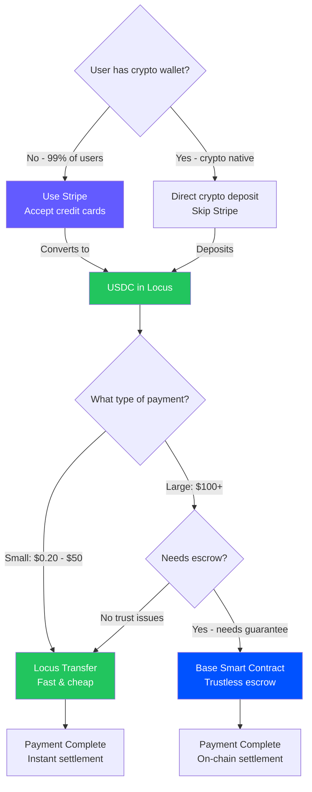

**Key Insight**: Each layer solves a different problem:
- **Stripe**: Mainstream user access (fiat on-ramp)
- **Locus**: Fast operational payments (agent-to-agent)
- **Base**: High-value trustless settlements (escrow)

---

## Locus in the Demo Flow: Step-by-Step

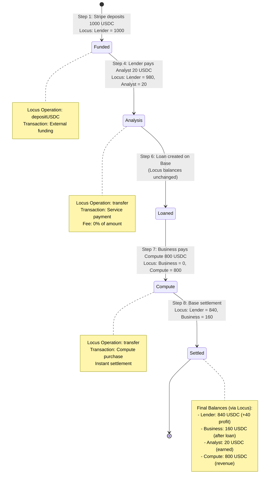

---

## Mock vs. Real Locus Implementation

### Current: Mock Implementation

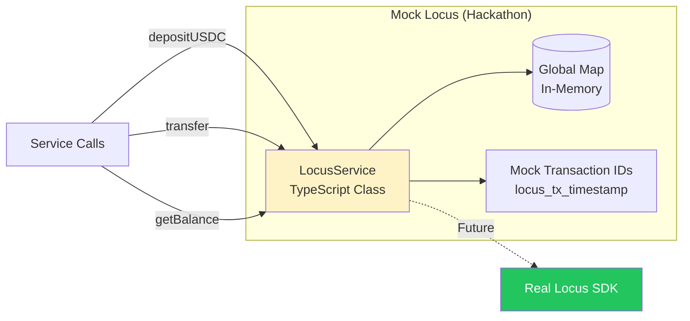

**Mock Service Behavior:**
- ✅ Simulates all Locus operations
- ✅ Returns realistic transaction IDs
- ✅ Validates balances (throws on insufficient funds)
- ✅ Console logs all operations
- ⚠️ Data only in memory (lost on restart)
- ⚠️ Not connected to real Locus infrastructure

---

### Future: Real Locus Integration

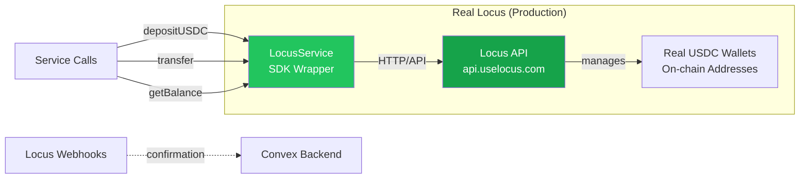

**Real Service Behavior:**
- ✅ Actually moves USDC on-chain
- ✅ Real wallet addresses
- ✅ Persistent balances
- ✅ Transaction confirmations
- ✅ Webhook notifications
- ⚠️ Requires API keys and configuration
- ⚠️ Subject to rate limits and network issues

---

## Key Metrics: Locus Transaction Volume in Demo

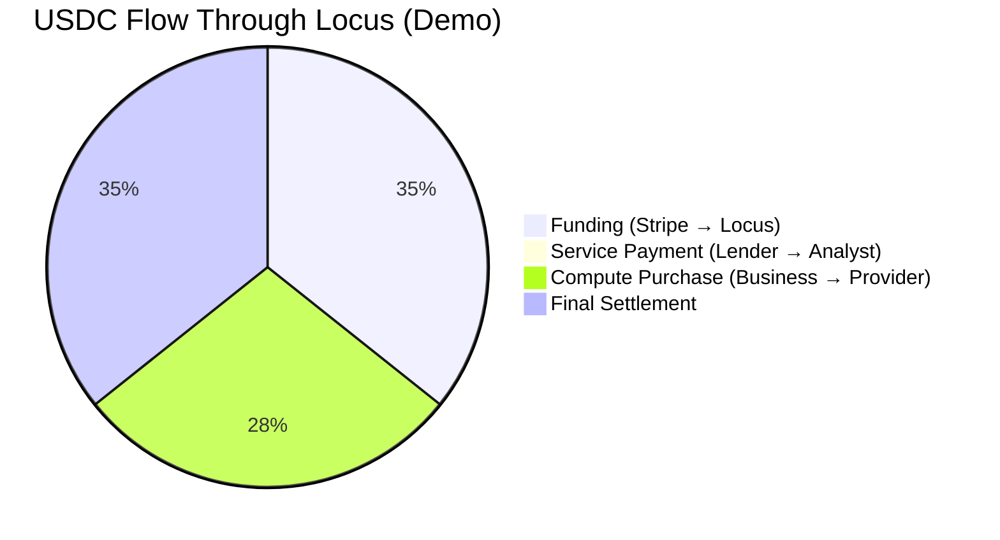

**Total USDC Moved Through Locus**: $1,820 across 4 operations

**Transaction Breakdown**:
1. **Deposit**: $1,000 (Stripe → Lender)
2. **Service Payment**: $20 (Lender → Analyst)
3. **Compute Purchase**: $800 (Business → Compute)
4. **Settlement**: $840 to Lender, $160 to Business (via Base, then visible in Locus)

**Average Transaction Size**: $455 USDC
**Smallest Transaction**: $20 USDC (credit analysis fee)
**Largest Transaction**: $1,000 USDC (initial funding)

---

## Summary

**Locus is the glue layer** that enables AI agents to operate as economic participants:

- **Accepts deposits** from fiat layer (Stripe)
- **Enables agent-to-agent commerce** (service payments, purchases)
- **Integrates with blockchain** for final settlements (Base)
- **Purpose-built for agents** (not humans)

Without Locus, agents would need to:
- Manage blockchain wallets directly (complex)
- Pay gas fees for every transaction (expensive)
- Wait for block confirmations (slow)
- Handle private key security (risky)

**Locus abstracts away blockchain complexity** while maintaining the benefits of crypto-native payments (fast, cheap, programmable).

---

## Related Documentation

- [FAQ.md](../FAQ.md) - Why Locus? (detailed comparison)
- [ARCHITECTURE.md](./ARCHITECTURE.md) - Full system architecture
- [tickets/TICKET-001](../tickets/TICKET-001-migrate-locus-to-convex-db.md) - Migration plan
- [convex/FUNDING_API.md](../convex/FUNDING_API.md) - Funding flow integration
